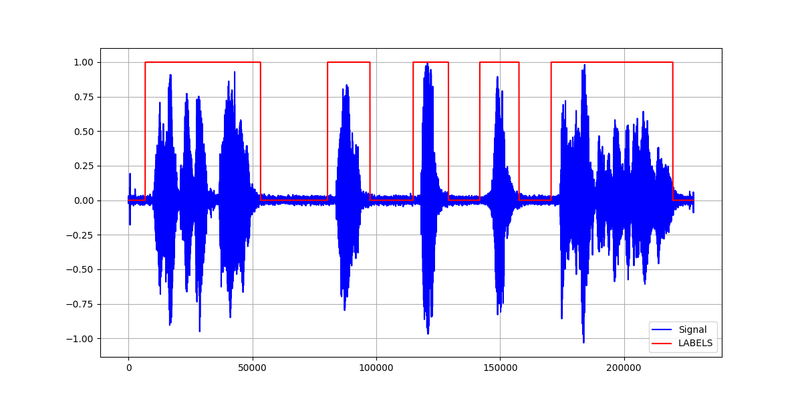

# STT-Pipeline

## Environment
```
conda create -n kvint python=3.10
conda activate kvint
pip install -r requirements.txt
```

## ClearML Agent
Хостим единственного агента на Google Collab
https://clear.ml/docs/latest/docs/guides/ide/google_colab/
https://colab.research.google.com/github/allegroai/clearml/blob/master/examples/clearml_agent/clearml_colab_agent.ipynb


## Preprocess
Беру файл, его делаю моноканальным и меня семпл рейт на 16 кГц. Для нового файла делаю манифест, который используется далее

## Voice Activity Detector:
файл взял отсюда: https://github.com/NVIDIA/NeMo/blob/main/examples/asr/speech_classification/vad_infer.py
с конфигом https://github.com/NVIDIA/NeMo/blob/f477e051ec68aaa909ca891c1605383f87e11fbb/examples/asr/conf/vad/vad_inference_postprocessing.yaml

Поисследовал

Увидел, что этот VAD работает хуже, чем VAD на фреймах

Поэтому взял пример отсюда https://github.com/NVIDIA/NeMo/blob/f477e051ec68aaa909ca891c1605383f87e11fbb/examples/asr/speech_classification/frame_vad_infer.py
с конфигом https://github.com/NVIDIA/NeMo/blob/f477e051ec68aaa909ca891c1605383f87e11fbb/examples/asr/conf/vad/frame_vad_infer_postprocess.yaml

## Промежуточная стадия
Получаю разметку RTTM после VAD, из неё извлекаю временные метки для голоса, а затем нарезаю вавку согласно этой разметке на несколько маленьких вавок.

## Voice Activity Detector:
Передаю список маленьких вавок для разметки. Пример работы взял отсюда: https://github.com/NVIDIA/NeMo/blob/stable/tutorials/asr/Multilang_ASR.ipynb
Получаю разметку для каждого отрывка

## Cleanup
Удаляю все побочные файлы - папку с разметкой, папку с вавками, файл манифеста и преобразованные вавки

# ENTRYPOINT

```
python pipeline.py --filename Recording.wav --filename Recording1.wav
```

В результате в конце выполнения пайплайна в выводе появятся расшифровки файлов, а в корне репозитория появятся изображения работы VAD для каждого из файлов. Пример изображения представлен ниже:

